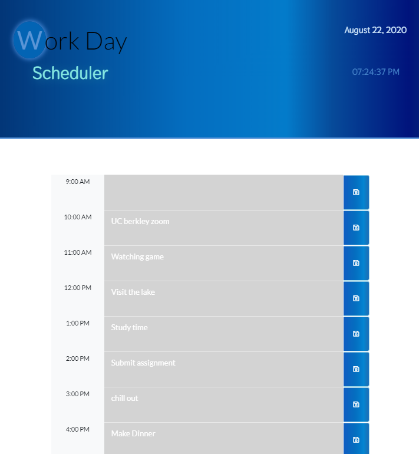
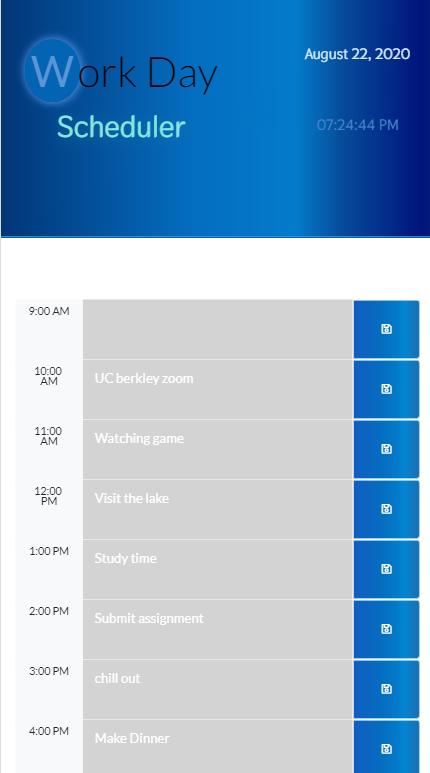

# Work-Day Scheduler

## Purpose

An app to help you schedule your plans in a daily basis

## Description

application that helps you to schedule your daily work plan,every time you are one hour left to particular plan it displays a reminder notification.Each hours schedule is displayed with different colors depending on which the plan is past or in the upcoming hours, this helps easly to identify every schedule

## Built With

- HTML
- CSS
- JAVASCRIPT
- jQuery
- Moment.js

## Website

https://solomonmeresa.github.io/Work-Daily-Scheduler/

## Visuals

Fully - responsive

## Contribution

Made by solomon

### ©️2020 Work-Day Schedule
